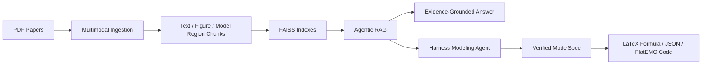

# -Mathematical_Draw
A multimodal scientific-paper intelligence system for retrieval, agentic reasoning, and harness-guided mathematical modeling.
# Mathematical Draw

> Agentic multimodal RAG for scientific papers, evidence-grounded mathematical modeling, and optimization-code generation.

Mathematical Draw is a research prototype that turns scientific papers into a
retrievable, inspectable, and agent-operable knowledge base. It combines
multimodal paper ingestion, vector retrieval, agentic evidence search,
harness-guided mathematical modeling, model verification, and PlatEMO/MATLAB
code generation.

The current source package is under [`MultiRAG-Doc-release/`](./MultiRAG-Doc-release).

## Why This Project

Scientific papers contain more than plain text: figures, tables, formulas,
captions, and modeling regions often carry the real technical value. A standard
text-only RAG pipeline cannot reliably retrieve or reuse these structures.

This project explores a stronger workflow:



## Highlights

- **Multimodal paper RAG**: parse PDFs into text, figures, captions, tables,
  equations, and model-aware regions.
- **Dual-path figure retrieval**: fuse image vectors and caption vectors to
  improve figure-level search.
- **Agentic evidence search**: use a LangGraph-style loop with controlled tool
  calls, evidence store, scoring, compression, and termination logic.
- **Harness-guided modeling agent**: constrain LLM generation through
  `ModelSpec`, `SymbolPlan`, operators, constraints, verification, and quality
  scoring.
- **Self-verification**: check variable definitions, constraint dependencies,
  objective completeness, symbol consistency, and scenario fit.
- **Optimization-code generation**: compile structured model drafts into
  PlatEMO/MATLAB problem skeletons.
- **Web workspace**: FastAPI backend plus browser UI for papers, query, ingest,
  agent search, and modeling.

## Key Results

Internal evaluation on the project benchmark shows:

| Capability | Result |
|---|---|
| Text retrieval | BGE-M3 improved Recall@1 by about **67%** and MRR by about **32%** over the MiniLM baseline |
| Figure retrieval | Image + caption fusion reached **R@1 0.833** and **MRR 0.884** |
| PDF QA retrieval | Reranking and deduplication improved MRR from **0.705** to **0.760** |
| HHC modeling | Harness workflow improved pass rate from **2/8** to **8/8** |
| Modeling latency | Harness single-case modeling was about **21x faster** than the pure LLM chain |

## System Workflow

### 1. Multimodal RAG

```text
PDF
  -> layout parsing
  -> text / figure / table / equation / model-region chunking
  -> caption generation
  -> text, image, and caption embedding
  -> FAISS indexing
  -> query planning
  -> multi-path retrieval
  -> fusion, reranking, deduplication
  -> grounded answer with citations
```

### 2. Automatic Mathematical Modeling Agent

```text
User modeling request
  -> intent parsing
  -> model-region evidence retrieval
  -> operator selection
  -> SymbolPlan + ModelSpec construction
  -> formula rendering
  -> verifier / critic
  -> structured model output
  -> PlatEMO/MATLAB code generation
```

## Tech Stack

| Layer | Technologies |
|---|---|
| Backend | Python, FastAPI, Pydantic-style schemas, CLI |
| Retrieval | FAISS, BGE-M3, BGE Reranker, image/caption fusion |
| Multimodal | Docling/PyMuPDF parsing, Qwen-VL captioning, image embeddings |
| Agent | LangGraph-style loop, tool registry, evidence store, termination policy |
| Modeling | Harness, ModelSpec, SymbolPlan, verifier, quality rubric, PlatEMO codegen |
| Frontend | HTML, Alpine.js, Tailwind CSS, SSE streaming |

## Repository Layout

```text
MultiRAG-Doc-release/
├── src/
│   ├── agent/          # Agent loop, tools, evidence store, termination
│   ├── evaluation/     # Retrieval metrics, guardrails, HHC modeling eval
│   ├── generator/      # LLM client, prompts, answer formatting
│   ├── index/          # FAISS vector store and metadata store
│   ├── ingestion/      # PDF parsing, chunking, captioning, embedding
│   ├── modeling/       # Harness, verifier, formula renderer, PlatEMO codegen
│   ├── pipeline/       # Ingest and query orchestration
│   ├── query/          # Standard, decomposed, and agent query modes
│   └── retrieval/      # Text/image retrieval, fusion, reranking, dedup
├── web/                # FastAPI backend and browser UI
├── database/testset/   # Curated HHC modeling testset
├── config.yml          # Default runtime configuration
├── environment_gpu.yml # Conda environment
└── README.md           # Detailed package documentation
```

## Quick Start

```bash
git clone https://github.com/zbdads/-Mathematical_Draw.git
cd -Mathematical_Draw/MultiRAG-Doc-release
conda env create -f environment_gpu.yml
conda activate multirag-doc-gpu
```

Create `.env` and add your model/API keys:

```text
LLM_API_KEY=your_llm_key_here
EMBEDDING_API_KEY=your_embedding_key_here
OPENAI_API_KEY=your_openai_compatible_key_here
```

Put papers into `database/pdf/`, then build indexes:

```bash
python -m src.cli ingest-all --pdf-dir database/pdf --multimodal --staged
```

Start the Web UI:

```bash
uvicorn web.main:app --reload --port 8000
```

Open:

```text
http://127.0.0.1:8000
```

## Example Commands

Grounded paper QA:

```bash
python -m src.cli query \
  --question "What optimization model is proposed in this paper?" \
  --mode standard \
  --generate
```

Agentic evidence search:

```bash
python -m src.cli query \
  --question "Explain the objective function and major constraints." \
  --mode agent \
  --generate
```

Harness-guided mathematical modeling:

```bash
python -m src.cli generate-model \
  --problem "Build a compact home health care routing and scheduling model that minimizes travel time and patient waiting time." \
  --harness-formulas
```

Modeling with PlatEMO/MATLAB code:

```bash
python -m src.cli generate-model \
  --problem "Build a home health care routing and scheduling model with assignment, routing, and time windows." \
  --harness-formulas \
  --platemo-code \
  --no-platemo-write
```

## Web Workspace

The Web UI includes:

- paper library management
- standard RAG query
- decomposed query
- agentic evidence search
- PDF ingestion with progress events
- modeling agent
- harness draft inspection
- PlatEMO code generation
- HHC modeling evaluation

## Recommended Repository Cleanup

For a more professional GitHub layout, move the contents of
`MultiRAG-Doc-release/` to the repository root:

```text
Mathematical-Draw/
├── README.md
├── config.yml
├── environment_gpu.yml
├── src/
├── web/
├── database/
├── docs/
└── examples/
```

This avoids making the repository look like a zip export and makes `README.md`,
`src/`, and `web/` visible immediately on GitHub.

## Limitations

- This is a research prototype, not a production-hardened service.
- Full multimodal ingestion may require GPU resources or external model APIs.
- Generated mathematical models and PlatEMO code should be reviewed before
  formal experiments.
- The modeling workflow is a controlled staged agent pipeline, not a fully
  autonomous swarm of independent agents.

## Project Pitch

Mathematical Draw is a harness-guided Agentic RAG system for evidence-grounded
automatic mathematical modeling from scientific papers. It combines multimodal
paper retrieval, controlled evidence search, structured model generation,
self-verification, and optimization-code generation into one research workflow.
